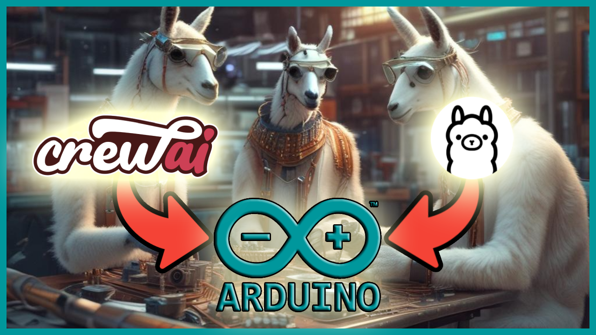

<div align="center">
  
  <h1>⚡ Autonomous Environmental AI Agent & Live Edge Copilot</h1>
  <p><b>Real-time sensor telemetry, closed-loop AI environmental reasoning, multi-actuator control, and dual-firmware sandboxing for Arduino.</b></p>

  <p>
    
    
    
    
    
  </p>
</div>

---

## 📖 Table of Contents

- [Overview](#-overview)
- [System Architecture](#-system-architecture)
- [Key Features](#-key-features)
- [Hardware Inventory & Pinout](#-hardware-inventory--pinout)
- [Prerequisites & Dependencies](#-prerequisites--dependencies)
- [Installation & Setup](#-installation--setup)
- [Usage Guide](#-usage-guide)
  - [1. Interactive Edge Copilot Session](#1-interactive-edge-copilot-session)
  - [2. One-Shot Command Mode](#2-one-shot-command-mode)
  - [3. Interactive Command Reference](#3-interactive-command-reference)
- [Dual-Firmware Sandbox Safety](#-dual-firmware-sandbox-safety)
- [Project Directory Structure](#-project-directory-structure)
- [Future Advancements](#-future-advancements)
- [Troubleshooting](#-troubleshooting)
- [License](#-license)

---

## 🌟 Overview

The **Autonomous Environmental AI Agent & Live Edge Copilot** bridges cutting-edge LLM intelligence with physical microcontrollers. Beyond simple one-way sketch compilation, this system establishes a **closed-loop bidirectional telemetry bridge** between an Arduino UNO and a Python-powered AI reasoning engine:

1. **Continuous Edge Perception**: Reads environmental data (temperature, humidity, ambient light) from hardware sensors in real time.
2. **Autonomous Background Reasoning**: An autonomous background observer evaluates ambient comfort and Heat Index metrics, issuing actionable advice and proactive control decisions.
3. **Multi-Component Actuation**: Automatically regulates room lighting with hysteresis thresholds, controls climate/AC advisory indicators, generates acoustic chimes, and streams messages across an I2C LCD screen via a multi-page paging engine.
4. **Sandboxed Code Experiments**: Lets users run exploratory firmware generation prompts in an isolated sandbox without overwriting or degrading the permanent telemetry firmware.

---

## 🏗️ System Architecture

```
┌────────────────────────────────────────────────────────────────────────┐
│                     Python AI Brain & Copilot                          │
│                                                                        │
│   • Background AI Observer (LLM Reasoning every 15s)                   │
│   • Heat Index Calculation & Environmental Analytics                   │
│   • Rich Interactive CLI Dashboard & HUD                              │
│   • Dynamic Sketch Generation & Isolated Hardware Sandbox              │
│   • Multi-Provider LLM Layer (OpenRouter / Ollama Fallback)            │
└───────────────────────▲────────────────────────┬───────────────────────┘
                        │                        │
       Live Telemetry   │ 115200 Baud            │ Framed RPC Commands
       (JSON Stream)    │ USB Serial Bridge      │ CMD:<id>:<payload> + ACK
                        │                        │ or arduino-cli Flash
┌───────────────────────┴────────────────────────▼───────────────────────┐
│                     Arduino Hardware Layer                             │
│                                                                        │
│   [DHT11 Sensor]       ──► Temperature & Humidity (Digital Pin 7)      │
│   [LDR Photoresistor]  ──► Ambient Light Lux Level (Analog Pin A0)     │
│   [16x2 I2C LCD]       ◄── Live Status HUD & Multi-Page AI Paging      │
│   [Room Light LED]     ◄── Autonomous / Commanded Lighting (Pin 4)     │
│   [AC Recommendation]  ◄── Climate Advisory Indicator (Pin 6)          │
│   [Alert Indicator]    ◄── Notification LED (Pin 5)                    │
│   [Piezo Buzzer]       ◄── Acoustic Feedback & Startup Melody (Pin 8)  │
└────────────────────────────────────────────────────────────────────────┘
```

---

## ✨ Key Features

- **⚡ Real-Time Serial Telemetry Stream**: Continuous streaming of sensor metrics over USB at `115200` baud with sub-second parsing into JSON telemetry payloads.
- **✅ Acknowledged Serial Protocol**: Host commands carry IDs and the board returns `ACK:<id>` so delivery can be tracked; legacy commands remain compatible.
- **🌡️ Environmental Intelligence**:
  - DHT11 temperature and humidity monitoring.
  - LDR photoresistor ambient light level tracking.
  - Real-time **Heat Index ("Feels Like")** calculation.
- **🤖 Autonomous Closed-Loop AI Observer**:
  - Runs in a non-blocking background thread.
  - Periodically synthesizes live sensor telemetry with LLM intelligence.
  - Generates ambient advice and pushes short summaries directly to the physical 16x2 LCD.
- **💡 Smart Hysteresis Auto-Lighting**:
  - Built-in hardware hysteresis (`< 50` lux turns ON; `> 70` lux turns OFF) preventing flickering during threshold transitions.
  - Toggleable between autonomous mode and manual AI override.
- **📟 Multi-Page LCD Paging Engine**:
  - Automatically word-wraps long AI messages across up to 6 pages (16 characters × 2 lines).
  - Auto-flips pages every 3.2 seconds accompanied by a subtle acoustic tick.
- **🛡️ Dual-Firmware Sandbox Architecture**:
  - Protects the core environmental firmware (`tmp/tmp.ino`) from being destroyed by experimental prompt queries.
  - Routes arbitrary user code generation requests to an isolated sandbox (`sandbox/sandbox.ino`).
  - Provides a single-command restore (`restore`) to flash the permanent firmware back onto the board at any time.
- **🔀 Multi-Provider LLM Integration**:
  - First-class support for **OpenRouter** (e.g. `minimax/minimax-m3:free`, `meta-llama/llama-3.3-70b-instruct`, etc.).
  - Automatic zero-configuration fallback to local **Ollama** (e.g. `qwen2.5-coder:3b` or `llama3`).
  - Supports standard OpenAI API keys if configured.
- **💻 Rich Interactive Terminal CLI**:
  - Formatted telemetry tables, hardware inventory view, status indicators, and syntax-highlighted firmware inspection.

### Safety boundary and testing

The Arduino remains authoritative for safety-sensitive local behavior. In
particular, automatic lighting and the AC indicator are driven by firmware
sensor heuristics; the AI can advise and display messages but cannot override
those decisions. Hardware-independent protocol tests can be run with:

```bash
python -m unittest discover -s tests -v
```

Python paths are resolved relative to the project directory, so the copilot
does not depend on the shell's current working directory. Experimental sketches
are still isolated in `sandbox/`; `restore` returns to `tmp/tmp.ino`.

---

## 🔌 Hardware Inventory & Pinout

The system is configured around an **Arduino UNO Rev3** board:

| Component | Pin / Bus | Mode / Type | Functional Role |
|:---|:---|:---|:---|
| **Arduino UNO Rev3** | USB (`/dev/cu.usbmodem*`) | Controller | Core microcontroller executing C++ firmware |
| **16x2 I2C LCD Display** | SDA: `A4`, SCL: `A5` | I2C (Address `0x27`) | Real-time sensor HUD and multi-page AI text paging |
| **DHT11 Sensor** | Digital Pin `7` | Digital Input | Temperature (°C) and relative humidity (%) sensing |
| **LDR (Photoresistor)** | Analog Pin `A0` | Analog Input | Measures ambient light (`< 50` dark, `> 70` bright) |
| **Room Light / Main LED** | Digital Pin `4` | Digital Output | Main lighting controlled autonomously or via RPC |
| **Alert / Indicator LED** | Digital Pin `5` | Digital Output | Visual status and warning indicator |
| **AC Advisory LED** | Digital Pin `6` | Digital Output | Illuminates when heat/humidity warrants air conditioning |
| **Piezo Buzzer** | Digital Pin `8` | PWM / Tone | Audio chimes, page-flip ticks, and startup boot chime |
| **Built-in LED** | Digital Pin `13` | Digital Output | Diagnostic board indicator |

> Configuration details are maintained in [hardware_context.json](hardware_context.json).

---

## 📦 Prerequisites & Dependencies

### 1. Arduino CLI & Board Core
Install the `arduino-cli` tool:

```bash
# macOS via Homebrew
brew install arduino-cli

# Verify installation
arduino-cli version
```

Install the AVR core:
```bash
arduino-cli core update-index
arduino-cli core install arduino:avr
```

### 2. Arduino Libraries
Install the necessary C++ libraries for the I2C LCD and DHT sensors:
```bash
arduino-cli lib install "LiquidCrystal I2C"
arduino-cli lib install "DHT sensor library"
arduino-cli lib install "Adafruit Unified Sensor"
```

### 3. Python Environment
Python **3.11+** is recommended:
```bash
python3 -m venv .venv
source .venv/bin/activate
pip install -r requirements.txt
```

---

## ⚙️ Installation & Setup

1. **Clone the repository**:
   ```bash
   git clone https://github.com/neural-maze/neural-hub.git
   cd neural-hub/arduino-agent
   ```

2. **Configure environment variables**:
   Copy the `.env.example` template:
   ```bash
   cp .env.example .env
   ```

   Edit `.env` with your API keys and hardware preferences:
   ```env
   # LLM Provider: 'openrouter' or 'ollama'
   LLM_PROVIDER=openrouter

   # OpenRouter Configuration
   OPENROUTER_API_KEY=your_openrouter_api_key_here
   OPENROUTER_MODEL=minimax/minimax-m3:free

   # Ollama Configuration (Fallback if OPENROUTER_API_KEY is not set)
   OLLAMA_MODEL=qwen2.5-coder:3b
   OLLAMA_BASE_URL=http://localhost:11434

   # Arduino Hardware Configuration (leave empty for auto-detection)
   ARDUINO_PORT=/dev/cu.usbmodem1101
   ARDUINO_BOARD=arduino:avr:uno
   ```

3. **Flash the Permanent System Firmware**:
   Connect your Arduino via USB and run:
   ```bash
   arduino-cli compile --fqbn arduino:avr:uno ./tmp
   arduino-cli upload -p /dev/cu.usbmodem1101 --fqbn arduino:avr:uno ./tmp
   ```
   *(Alternatively, start the interactive session and enter `upload` or `restore`)*.

---

## 🚀 Usage Guide

### 1. Interactive Edge Copilot Session

Launch the interactive copilot session:

```bash
python main.py
```

Upon launching, the copilot will:
1. Auto-detect the connected Arduino port and FQBN.
2. Establish a bidirectional USB serial connection at `115200` baud.
3. Start the background **Autonomous AI Environmental Observer**.
4. Present a live command prompt for questions, direct actuation, and experimental generation.

### 2. One-Shot Command Mode

You can also pass instructions directly from the command line:

```bash
python main.py "Turn on the room light and display 'Welcome Home' on the LCD"
```

### 3. Interactive Command Reference

Inside the interactive copilot session (`python main.py`), the following built-in commands are available:

| Command | Description |
|:---|:---|
| `status` / `telemetry` | Displays the live sensor table (Temp, Humidity, Heat Index, LDR, Actuator states, and latest AI recommendation). |
| `suggest` / `ai` | Manually triggers an immediate LLM evaluation of the current sensor telemetry. |
| `sandbox` / `run sandbox` | Compiles and flashes the isolated experiment sketch ([sandbox/sandbox.ino](sandbox/sandbox.ino)) to the Arduino. |
| `restore` / `main` | Re-compiles and re-flashes the permanent Environmental AI Agent firmware to the Arduino. |
| `code main` | Displays the active permanent C++ firmware ([tmp/tmp.ino](tmp/tmp.ino)) with syntax highlighting. |
| `code sandbox` | Displays the current isolated sandbox C++ sketch ([sandbox/sandbox.ino](sandbox/sandbox.ino)). |
| `clear` / `hud` | Clears any active AI message paging and restores the default sensor telemetry HUD on the physical LCD. |
| `board` | Queries and displays the detected Arduino board port and FQBN. |
| `hw` / `hardware` | Shows the connected hardware components, pinouts, and notes. |
| `add <description>` | Adds a new component to the active [hardware_context.json](hardware_context.json). |
| `upload` | Flashes the permanent Environmental Agent firmware to the board. |
| `exit` / `quit` | Gracefully terminates background threads, closes serial ports, and exits. |

#### Example Natural Language Prompts:
- **Direct Actuation**:
  - *"Turn on the room light"*
  - *"Turn off the light"*
  - *"Sound the buzzer"*
  - *"Say 'Meeting in Progress' on the LCD screen"*
- **Environmental Queries**:
  - *"Is the room too warm?"*
  - *"What is the current humidity and should I turn on the AC?"*
  - *"How is the lighting right now?"*
- **Sandbox Firmware Experiments**:
  - *"sandbox blink light twice"*
  - *"Rewrite the code to blink the alert LED three times whenever temperature exceeds 27C"*
  - *(Runs safely in `sandbox/sandbox.ino` without touching permanent telemetry firmware!)*

---

## 🛡️ Dual-Firmware Sandbox Safety

To prevent LLMs from accidentally wiping out the telemetry streaming and LCD paging logic, this project implements a **dual-firmware architecture**:

```
arduino-agent/
├── tmp/
│   └── tmp.ino                  <-- Permanent System Firmware (Telemetry + RPC + LCD HUD)
└── sandbox/
    └── sandbox.ino              <-- Isolated sandbox for experimental sketch prompts
```

1. **Safety Separation**: When you run a sandbox experiment (e.g., *"sandbox blink light twice"*), the sketch is compiled and flashed from the `sandbox/` directory.
2. **Instant Restore**: Whenever you want to return to the live telemetry and environmental copilot mode, simply type `restore` in the CLI prompt. The copilot automatically re-flashes `tmp/tmp.ino` and resumes live serial telemetry.

---

## 📁 Project Directory Structure

```
arduino-agent/
├── .env.example             # Template for API keys and board settings
├── AI_ADVANCEMENTS.md       # Architectural deep-dive & advanced project concepts
├── README.md                # Project documentation
├── requirements.txt         # Python dependencies (OpenAI, rich, pyserial, dotenv)
├── hardware_context.json    # Hardware pinouts and component specifications
├── main.py                  # CLI entry point, banner, and interactive loop
├── copilot.py               # Serial bridge, telemetry parser, background AI observer, RPC
├── serial_protocol.py       # Serial RPC command framing and ACK parser
├── tests/
│   └── test_protocol.py     # Unit test suite
├── sandbox/
│   └── sandbox.ino          # Isolated sketch workspace for experimental user prompts
└── tmp/
    └── tmp.ino              # Active permanent system firmware with serial telemetry & HUD
```

---

## 🔬 Future Advancements

Check out [AI_ADVANCEMENTS.md](AI_ADVANCEMENTS.md) for full architectural blueprints and concept designs, including:
- **Smart Desk Ergonomics & Posture Coach** using HC-SR04 ultrasonic distance sensing.
- **Multi-Stage Perimeter Security Sentry** with escalating alert tiers.
- **Touchless Ultrasonic Theremin** musical gesture synthesizer.
- **Autonomous Sensor Auto-Calibration & Self-Healing Firmware**.

---

## ❓ Troubleshooting

### 1. Serial Port Permission Denied / Port Busy
- Make sure the Arduino IDE Serial Monitor or any other terminal program using the port is closed.
- On macOS, permissions are generally granted automatically, but ensure your user has read/write access to `/dev/cu.usbmodem*`.

### 2. Compilation Fails: Library Not Found
If compilation errors indicate missing header files (e.g., `LiquidCrystal_I2C.h` or `DHT.h`):
```bash
arduino-cli lib install "LiquidCrystal I2C"
arduino-cli lib install "DHT sensor library"
```

### 3. OpenRouter Rate Limits / Fallback
If your OpenRouter free-tier credit expires or reaches rate limits, the system automatically falls back to local Ollama (if running) without crashing. To use Ollama locally:
```bash
ollama run qwen2.5-coder:3b
```

---

## 📄 License

This project is licensed under the MIT License. See the root [LICENSE](../LICENSE) file for details.
